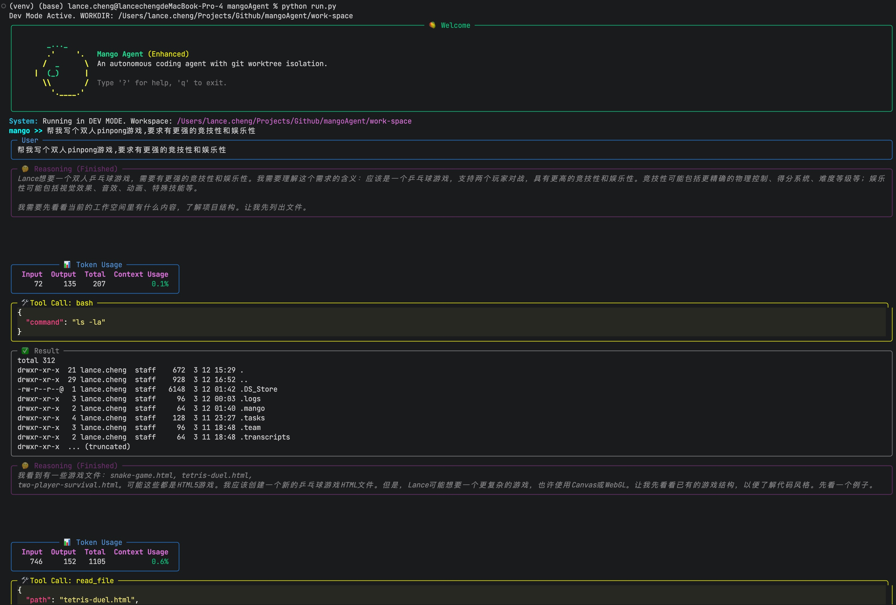
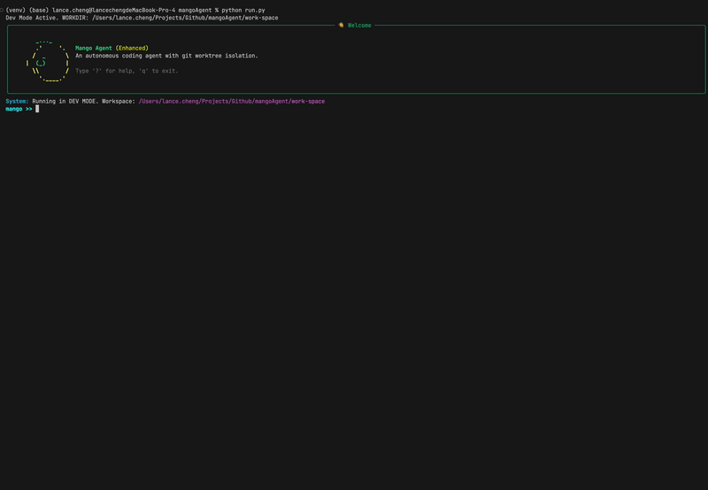
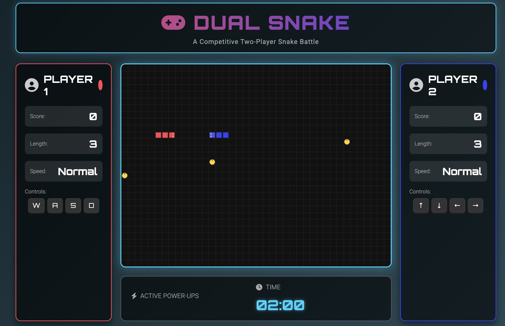
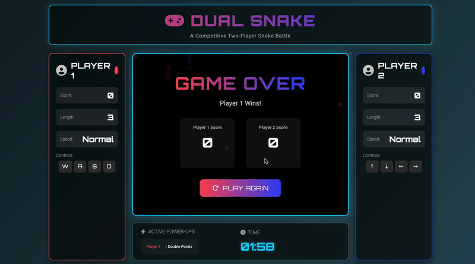
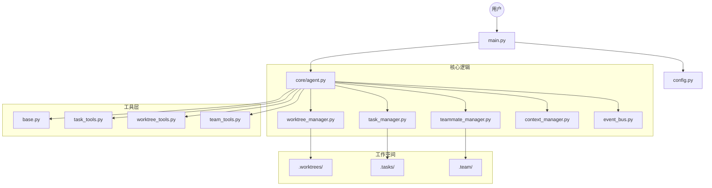

# Mango Agent (芒果智能体)

[English Version](#english-version) | [中文版本](#中文版本)

<a name="english-version"></a>
## 🥭 English Version

### Introduction

Mango Agent is an educational project designed to guide developers through the step-by-step construction of a sophisticated AI coding agent. It is not just a tool, but a learning journey that demonstrates how to build an autonomous system with modularity, task isolation, and team collaboration capabilities.

Built with Python and leveraging Large Language Models (LLMs) like Claude or DeepSeek, Mango Agent showcases modern agentic design patterns including:

-   **Object-Oriented Architecture**: Clean separation of concerns (Core, Tools, Managers).
-   **Worktree Isolation**: Using Git worktrees to safely execute tasks in isolated environments without polluting the main codebase.
-   **Autonomous Collaboration**: Supporting sub-agents and persistent teammates for parallel task execution.
-   **Tool-Use Ecosystem**: A robust framework for file operations, command execution, and context management.

### Core Features

1.  **🛡️ Worktree Isolation (The Core)**
    -   **Task-Binding**: Create tasks and bind them to dedicated Git worktrees.
    -   **Safe Sandbox**: All experimental code changes happen in isolated directories (`.worktrees/`), keeping your main branch clean.
    -   **Context Safety**: Execute commands and tests in isolation.

2.  **🤖 Autonomous Capabilities**
    -   **Subagents**: Delegate research or exploration tasks to ephemeral sub-agents.
    -   **Teammates**: Spawn persistent autonomous agents that run in parallel threads to handle background work.
    -   **Skill System**: Load specialized knowledge via markdown files to enhance agent capabilities on demand.

3.  **🛠️ Developer Experience**
    -   **Rich REPL**: Interactive command-line interface with colored output and command history.
    -   **Context Management**: Automatic and manual token management (`/compact`) to handle long conversations efficiently.
    -   **Directory Management**: Built-in tools for navigating and manipulating the workspace file system.

### 🎥 Showcase

Check out Mango Agent in action:

**1. Startup & REPL Interface**



**2. Autonomous Game Development**
*Mango Agent generating a Snake Game:*



> 💡 **Tip**: The source code for this Dual Snake Game is available in the [showcase/snake-game](showcase/snake-game) directory. Feel free to try it out!

### Project Structure

The project is structured to be easily understood and extended:


```text
mangoAgent/
├── run.py                  # Entry point (Development)
├── install.sh              # Installation script
├── doc/                    # Documentation and media
│   ├── media/              # Images and videos
│   └── ...                 # Other documentation files
├── core/                   # The Brain of the Agent
│   ├── agent.py            # Main agent loop
│   └── ...
├── tools/                  # The Hands of the Agent
│   └── ...
└── work-space/             # The Playground
```

### Installation (CLI)

You can install Mango Agent as a global command-line tool.

1.  **Clone and Install**:
    ```bash
    git clone https://github.com/your-username/mangoAgent.git
    cd mangoAgent
    ./install.sh
    ```
    
2.  **Usage**:
    Once installed, you can run `mango` from any directory:
    ```bash
    # Run in current directory
    mango
    ```

### Development

If you want to contribute or modify the agent:

1.  **Dev Mode**:
    ```bash
    # Run from source without installing
    python3 run.py
    ```
    This will launch the agent in a dedicated `work-space` directory inside the project root, protecting your system files.

### Configuration

Mango Agent looks for configuration in the following order:
1.  Current directory `.env`
2.  `~/.mango/config` (Future)
3.  Project root `.env` (Dev Mode only)

You can copy the example file to start:
```bash
cp .env.example .env
```

Edit the `.env` file with your API keys:
```env
ANTHROPIC_API_KEY=your_key_here
# Or for compatible APIs (like DeepSeek)
ANTHROPIC_BASE_URL=https://api.deepseek.com/anthropic
DEEPSEEK_API_KEY=your_key_here
MODEL_ID=deepseek-chat
```

### Workflow Example

1.  **Start a task**:
    ```text
    mango >> Create a task "Build Snake Game" and bind it to worktree "game-dev"
    ```
2.  **Switch context**:
    ```text
    mango >> change_directory "game-dev"
    ```
3.  **Delegate**:
    ```text
    mango >> Use a subagent to research "Single HTML file Snake Game implementation"
    ```
4.  **Develop**:
    ```text
    mango >> Write the index.html based on the research
    ```

---

<a name="中文版本"></a>
## 🥭 中文版本

### 简介

Mango Agent（芒果智能体）是一个教育性质的开源项目，旨在引导开发者一步步构建一个复杂的 AI 编程智能体。它不仅仅是一个工具，更是一段学习旅程，展示了如何利用模块化、任务隔离和团队协作等思想来构建现代化的自主系统。

该项目基于 Python 构建，利用 Claude 或 DeepSeek 等大语言模型（LLM）的能力，展示了以下核心设计模式：

-   **面向对象架构**：清晰的核心逻辑、工具集和管理器的职责分离。
-   **Worktree 隔离**：利用 Git worktree 机制在隔离环境中安全执行任务，绝不污染主代码库。
-   **自主协作**：支持创建子智能体（Subagent）和持久化队友（Teammates）进行并行任务处理。
-   **工具生态**：提供了一套完整的文件操作、命令执行和上下文管理的工具框架。

### 核心特性

1.  **🛡️ Worktree 隔离机制 (核心)**
    -   **任务绑定**：创建开发任务并将其绑定到独立的 Git worktree。
    -   **安全沙箱**：所有的代码实验和修改都在 `.worktrees/` 下的独立目录中进行，主分支始终保持干净。
    -   **环境隔离**：在隔离的环境中执行命令和测试，互不干扰。

2.  **🤖 自主能力**
    -   **子智能体 (Subagents)**：将调研、探索等临时性任务委派给子智能体完成。
    -   **队友系统 (Teammates)**：生成持久运行的自主智能体线程，在后台并行处理任务。
    -   **技能系统 (Skills)**：通过加载 Markdown 格式的技能文件，按需扩展智能体的专业知识。

3.  **🛠️ 开发者体验**
    -   **增强型 REPL**：带有彩色输出、状态监控和命令历史的交互式命令行界面。
    -   **上下文管理**：支持自动和手动的 Token 压缩（`/compact`），高效处理长对话。
    -   **目录管理**：内置完整的文件系统导航和操作工具，像在终端一样自由切换目录。

### 🎥 效果展示

查看 Mango Agent 的运行效果：

**1. 启动与交互界面**


**2. 自主开发小游戏**
*使用 Mango Agent 生成的双人贪吃蛇对战游戏：*


> 💡 **提示**: 这个双人贪吃蛇游戏的源码就在 [showcase/snake-game](showcase/snake-game) 目录下，欢迎大家体验！

### 项目结构

项目结构清晰，便于学习和扩展：



```text
mangoAgent/
├── run.py                  # 运行入口 (开发模式)
├── install.sh              # 安装脚本
├── doc/                    # 项目文档与媒体
│   ├── media/              # 图片与视频
│   └── ...                 # 其他说明文档
├── core/                   # 智能体大脑
│   ├── agent.py            # 主运行循环
│   └── ...
├── tools/                  # 智能体双手
│   └── ...
└── work-space/             # 游乐场
```

### 安装 (命令行)

您可以将 Mango Agent 安装为全局命令行工具。

1.  **克隆并安装**:
    ```bash
    git clone https://github.com/your-username/mangoAgent.git
    cd mangoAgent
    ./install.sh
    ```

2.  **使用**:
    安装完成后，您可以在任意目录下运行 `mango`：
    ```bash
    # 在当前目录运行
    mango
    ```

### 开发模式

如果您想修改或贡献代码：

1.  **Dev Mode**:
    ```bash
    # 直接从源码运行，不安装
    python3 run.py
    ```
    这将在项目根目录下的 `work-space` 目录中启动 agent，保护您的系统文件。

### 配置

Mango Agent 按以下顺序查找配置：
1.  当前目录 `.env`
2.  `~/.mango/config` (计划中)
3.  项目根目录 `.env` (仅限 Dev Mode)

您可以复制示例文件开始配置：
```bash
cp .env.example .env
```

编辑 `.env` 文件填入您的 API Key：
```env
ANTHROPIC_API_KEY=your_key_here
# 如果使用兼容 API (如 DeepSeek)
ANTHROPIC_BASE_URL=https://api.deepseek.com/anthropic
DEEPSEEK_API_KEY=your_key_here
MODEL_ID=deepseek-chat
```

### 工作流示例

1.  **开启任务**:
    ```text
    mango >> 创建一个任务 "开发贪吃蛇游戏" 并绑定到 worktree "game-dev"
    ```
2.  **切换环境**:
    ```text
    mango >> change_directory "game-dev"
    ```
3.  **委派调研**:
    ```text
    mango >> 使用子智能体调研 "单文件 HTML 贪吃蛇游戏实现方案"
    ```
4.  **开始开发**:
    ```text
    mango >> 根据调研结果编写 index.html 代码
    ```

### 学习指南

建议按照以下顺序阅读代码以深入理解：
1.  `main.py`: 理解系统的启动和组件组装。
2.  `core/agent.py`: 学习 LLM 的思考-行动（ReAct）循环是如何实现的。
3.  `core/worktree_manager.py`: 探索如何利用 Git 命令实现代码隔离。
4.  `core/teammate_manager.py`: 研究多线程智能体是如何并行工作并通信的。

---
*Happy Coding with Mango! 🥭*
